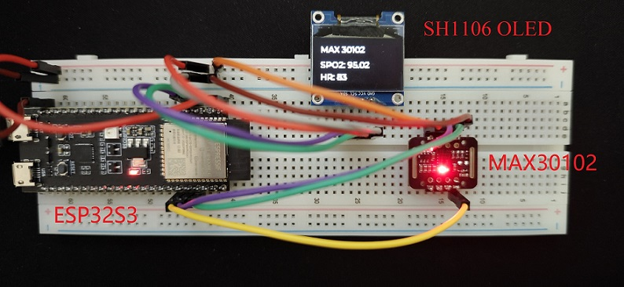

# ESP-IDF 项目实践

---

## 项目介绍

血氧仪

- 测量并计算血氧值
- 显示在OLED屏幕上

目的

- 演示实际IDF项目开发过程涉及到的：
  - 组件获取、移植
  - 业务逻辑梳理
  - 自顶向下设计
  - 基于操作系统的异步业务逻辑
  - …………

---

## 硬件需求

- ESP32-S3 开发板
- MAX30102 血氧模块
- SH1106 OLED 屏幕

---

## 软件需求

IDF v5.2.1 本地组件：

- driver
- esp_lcd

远程组件：

- lvgl/lvgl: 8.3.0

`idf.py add-dependency "lvgl/lvgl~8.3.0"`

- esp_lvgl_port: ^1

`idf.py add-dependency "esp_lvgl_port^1"`

自定义组件：

- max30102
- algorithm

---

## 项目业务模块

1. I2C通信
   - 初始化2个I2C总线分别驱动MAX30102模块和OLED屏幕
2. OLED显示任务
   - 初始化OLED屏幕（硬件）与lvgl任务（软件）
   - 接口：更新显示内容
3. max30102模块数据读取任务
   - 初始化MAX30102模块（硬件）与读取任务（软件）
   - 接口：获取测量结果
4. 顶层任务（main）
   - 初始化上述三个业务
   - 循环读取传感器数据、计算出结果并在OLED屏幕上显示

---

## 步骤（自顶向下设计）

1. 创建项目
2. 添加依赖组件
3. 组件移植/接口实现
4. 顶层任务逻辑
5. 显示任务
   - 基于`examples\peripherals\lcd\i2c_oled`例程
6. 传感器测量任务（异步：测量、计算、结果获取）
   - 软件：创建信号量、队列及线程
   - 硬件：初始化GPIO中断、传感器硬件
   - 业务：中断的异步处理（信号量），回调计算、结果入队列
   - 接口：从队列中获取结果
